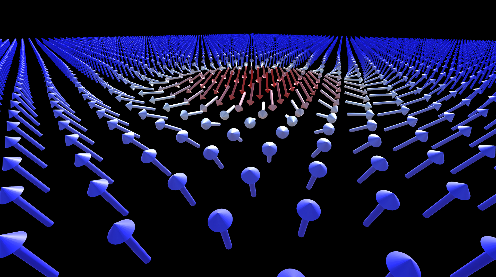

# 🎮 Spin Visualization in Unity

This repository, `spin_visualization_unity`, provides tools to visualize and interact with the spin configurations generated by the PyMMF framework. --> s. https://github.com/AntonKettner/PyMMF

Utilizing Unity's robust 3D rendering capabilities, it allows users to explore spin fields in an intuitive and interactive manner.

## 🎨 Features

- 3D Navigation: Move around the spinfield like in Minecraft, using `W`, `A`, `S`, `D` for lateral movement, `Shift` to descend, and `Space` to ascend.
- Spinfield Exploration: Fly through the spinfield to examine the configuration more closely.
- Time Sequence Navigation: Use the arrow keys to load the next or previous spinfield configuration.
- Time-Lapse Creation: Press `P` to play forward through the spinfield configurations and record a video. Press `P` again to stop the recording.
- Reverse Playback: Press `B` to play the spinfield configurations backward.

## 🔗 Integration with PyMMF

The visualization tool is directly connected to the PyMMF micromagnetic simulation framework, allowing seamless loading and visualization of spin configurations generated by PyMMF.

## 🛠️ Getting Started

Prerequisites

- Ensure that you have Unity version compatible with the project files.
- Have basic knowledge of both Unity and the PyMMF framework.

Installation

1. Clone the Repository:

```shell
git clone github.com/AntonKettner/spin_visualization_unity
cd spin_visualization_unity
```

2. Open with Unity Editor:
   - Launch Unity Hub.
   - Open the `spin_visualization_unity` project by navigating to the cloned repository.

3. run the scene

Running the Visualization

- Open the Unity Editor.
- Press the 'Play' button in Unity to start interacting with the spinfield.
- Use the specified keys for navigation and recording.

## 🛠️ Controls Overview

- Move Forward/Backward: `W`, `S`
- Strafe Left/Right: `A`, `D`
- Ascend/Descend: `Space`, `Shift`
- Load Next/Previous Spinfield: Arrow keys
- Play/Pause Forward Sequence: `P` key
- Play Backward Sequence: `B` key

## 🎥 Usage

-Explore the spinfield configurations generated by PyMMF within this Unity project. Adjust your viewpoint to gain new insights into the magnetic structures.


-When adding new spinfield data (json files) for visualization, the corresponding relativePath vars in Skyr_data_loader.cs and Spin_Visualizer need to be changed to the correct path.


-"Play" saves videos of each step to OUTPUT

-> (with ffmpeg installed):compress.ps1 combines all mp4 into one mp4: output_0.mp4

-> OPTIONAL: DeleteOldMP4sScript.ps1 deletes all "video_*.mp4" scripts in the folder to be ready for the next recording

## 📷 Low res example of the output mp4


## 🤝 Contributing

Contributions to enhance functionality or to fix issues are welcome. Please fork the repository and submit a pull request with your changes.
